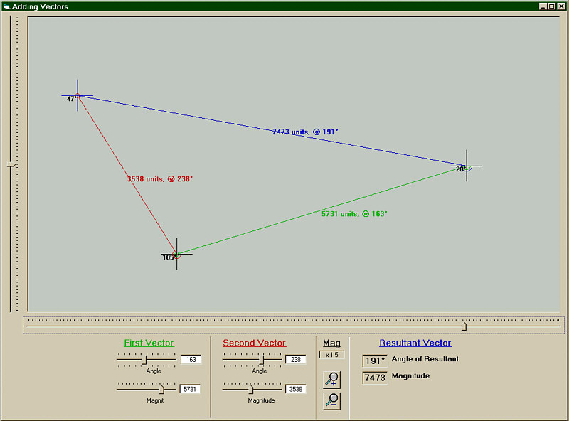



## Add Two Vectors

### Description

This code will allow the user to make two vectors, (a length and an angle), and add them together to find out what the resultant vector is.
 
### More Info
 

             |
---                |---
**Submitted On**   |2000-06-05 18:28:30
**By**             |[Sarah Mathiason](https://github.com/Planet-Source-Code/PSCIndex/blob/master/ByAuthor/sarah-mathiason.md)
**Level**          |Intermediate
**User Rating**    |4.9 (39 globes from 8 users)
**Compatibility**  |VB 5\.0, VB 6\.0
**Category**       |[Math/ Dates](https://github.com/Planet-Source-Code/PSCIndex/blob/master/ByCategory/math-dates__1-37.md)
**World**          |[Visual Basic](https://github.com/Planet-Source-Code/PSCIndex/blob/master/ByWorld/visual-basic.md)
**Archive File**   |[CODE\_UPLOAD6464652000\.zip](https://github.com/Planet-Source-Code/sarah-mathiason-add-two-vectors__1-8659/archive/master.zip)

